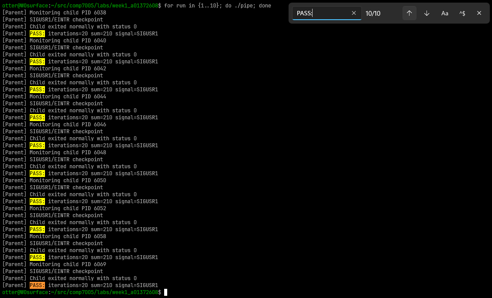
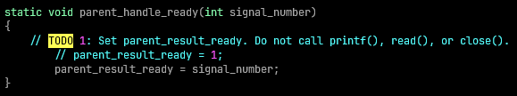
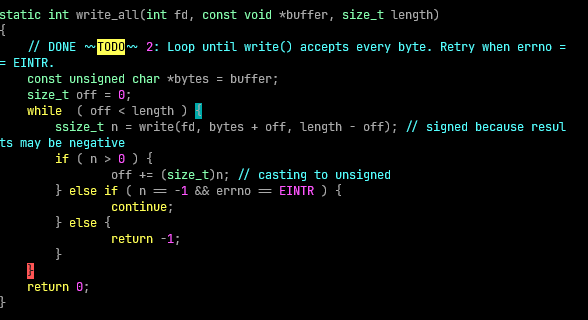
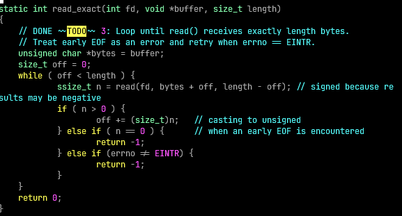
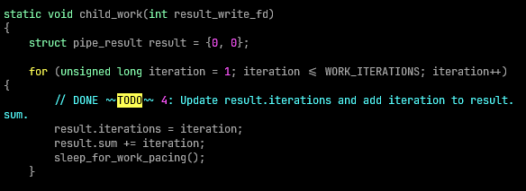
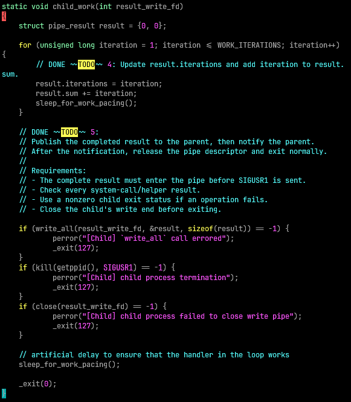
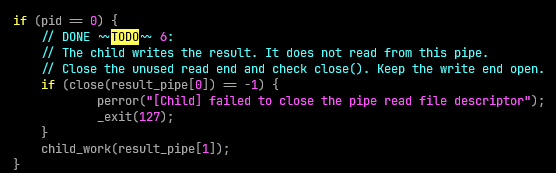
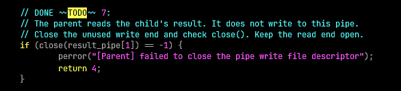
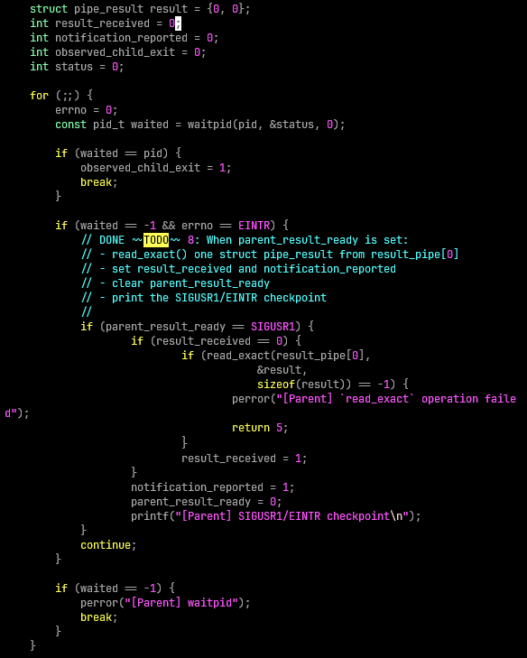
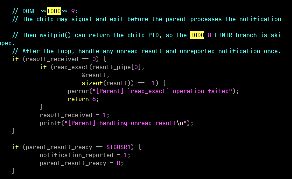

# COMP7005 Week 1 Lab Report

Will Otterbein, A01372608

## Results

Here are the results of executing the compiled `pipe` binary:

## TODO 1

**parent_handle_ready** implementation

- In this snippet, simple we are setting the `parent_result_ready` flag to have the value of whatever signal is incoming (in our case this will be `SIGUSR1`)
- `parent_result_ready` as per the template code is a `volatile` variable of the `sig_atomic_t` type

## TODO 2

**write_all** implementation

- As per the example implementation, this function creates an unsigned char pointer `bytes` and an offset tracker of type `size_t` named `off`
- the function loops on the condition that the value of `off` (which is a byte offset) is less than the length of the input buffer (named `buffer`)
- for each iteration, the `write` syscall is attempted, starting from the `bytes` pointer plus whatever the offset is currently, and for a length that is the entire buffers length minus the offset (ie. the remaining memory segment)
- if write succeeeds (`n > 0`) then we increment the offset & loop (if the entire segment wasn't written then we will write the remainder)
- additionally, if there is an error (`n == -1`) but `errno` is `EINTR` we continue, otherwise the function returns w/ an error value of -1
- successful return value is 0

## TODO 3

**read_exact** implementation

- As per the example implementation, this function creates an unsigned char pointer `bytes` to the buffer and an offset tracker of type `size_t` named `off`
- the function loops on the condition that the value of the offset tracker `off` is less than the length of the input buffer (named `buffer`)
- for each iteration the `read` syscall is attempted, starting from the `bytes` pointer plus whatever the offset is currently, and for a length that is the entire buffers length minus the offset (ie. the remaining memory segment)
- if the read succeeds (`n > 0`) then we increment the offset & loop (if the entire segment wasn't read then we will read the remainder)
- if there was an error executing read that does not have `errno` equalling `EINTR`, or EOF is encountered early, we return `-1` error value

## TODO 4

**child_work** result struct field population

- this is the implementation of the childs work, which is tracking the current iteration number and then incrementing the counter with the value of the iteration

## TODO 5

**child_work** result struct write to pipe, send signal to parent, close write file descriptor

- after the snippet from todo4 run populating the fields of the `result` struct (`pipe_result_type`), we invoke the `write_all` function previously described, we give the `result_write_fd` as the file descriptor (if this call fails returning `-1`, we log this error and exit w/ a non-zero exit code).
- after writing the result struct to the pipe, we then use the `kill` syscall to send the `SIGNUSR1` signal to the parent process. It this syscall fails, we log an error and exit w/ a non-zero exit code. We get the parent's PID using the `getppid` syscall (as per `man 2 getppid` there is no need to handle syscall errors for this syscall, because it always succeeds).
- then we make our final syscall in this method, which is `close` on the `result_write_fd` file descriptor, checking for errors & reporting them as well as exiting w/ non-zero exit code.

> for this TODO, I added a sleep after closing the file descriptor & sending the signal to test that the logic in the loop & the outer logic were both accomplishing the same thing, I found without this delay the child process would always exit before the signal was processed in the main loop

## TODO 6

- if the return value of `fork` is the value 0 this means that the execution context is that of the child process, and so this todo snippet in `main` is responsible for closing the `result_pipe` read file descriptor (index 0) of the pair of file descriptors returned by the `pipe` syscall earlier in the template code. The child process only needs to write data to the `result_pipe`
- we also invoke `child_work` with the `result_pipe` write file descriptor (index 1 of the pair returned by the earlier `pipe` syscall)

## TODO 7

- proceeding with the parent process executing context in `main`, we are closing the write pair of the `result_pipe` file descriptors (index 1), as the parent process does not need to write any data to the pipe (`close` syscall)
- we handle the error state of the `close` syscall (checking if the return of this is `-1`)

## TODO 8

- now we are in the "main" loop of the `main` method, where the parent process is waiting for the child process
- herein the implementation is under the `if (waited == -1 && errno == EINTR)` condition, meaning that `waitpid` syscall is waiting still for the child process and that the syscall was interrupted by a signal
- then we check the flag `parent_result_ready` equals are expected signal of `SIGUSR1`, if this is true we also check that `result_received` is 0, then we execute our implementation of `read_eexact` into the target struct named `result`, checking for the error return value of `-1` (if there is an error, we log this and return from the program)
- if `read_exact` executes successfully, then we set `result_received` to 1.
- regardless of whatever happens with read, we set `notification_reported` to 1 inside the if block checking the signal to record that the notification was reported (we write a checkpoint message via `printf` as well) and reset `parent_result_ready` to 0

## TODO 9

- Finally we check both flags after the "main" loop, in the case that the child process exits before the signal is processed by the condition in the earlier loop
- if `result_recieved` is still zero, then we execute the read operation (with error handling the same as before, an argument is to be made that I should have created a function for this), we set `result_recieved` to 1 indicating now that we have received the results from the pipe & wrote them into the `result` struct
- also the program checks that the `parent_result_ready` flag has the value of the `SIGUSR1` signal & sets `notification_reported` to 1 & clears the `parent_result_ready` flag (sets it to zero)

